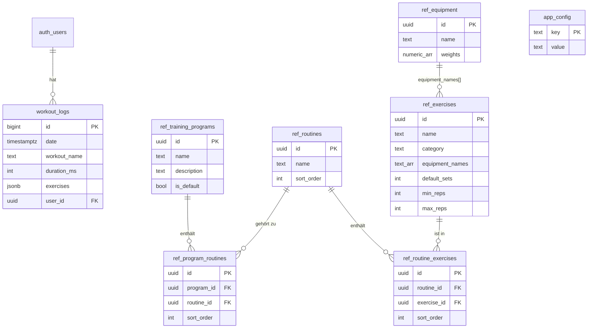
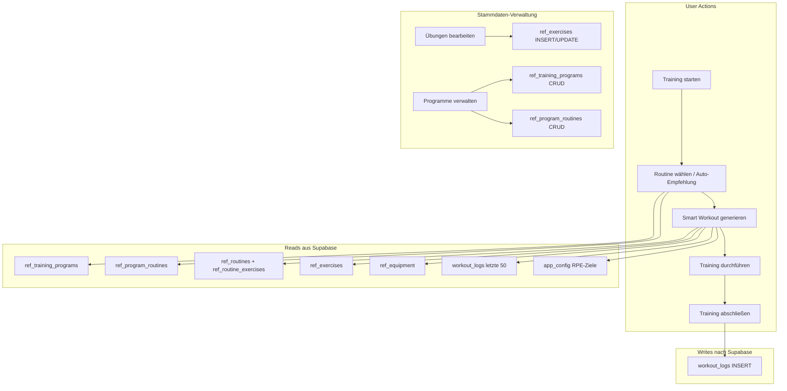

# Gym App – Vollständige Architektur & Datenbankschema

## 1. Datenbankschema (Supabase / PostgreSQL)

### 1.1 `workout_logs` – Trainings-Protokoll

Die zentrale Tabelle für alle absolvierten Trainings.

```sql
CREATE TABLE workout_logs (
  id          BIGINT GENERATED ALWAYS AS IDENTITY PRIMARY KEY,
  date        TIMESTAMPTZ NOT NULL,         -- Zeitpunkt des Trainings (als "naive UTC" = lokale Zeit)
  workout_name TEXT NOT NULL,                -- Name der Routine (z.B. "Push", "Pull", "Legs")
  duration_ms  INTEGER,                      -- Dauer in Millisekunden
  exercises   JSONB NOT NULL,                -- Array von Übungs-Objekten (siehe unten)
  user_id     UUID REFERENCES auth.users(id),-- Supabase Auth User
  created_at  TIMESTAMPTZ DEFAULT now()      -- Auto-generiert
);

CREATE INDEX idx_workout_logs_user_id ON workout_logs(user_id);
```

**`exercises` JSONB-Struktur** (Array):
```json
[
  {
    "name": "Bankdrücken LH",
    "sets": 4,
    "reps": "9;9;8;8",       -- Semicolon-getrennt pro Satz
    "weight": "40;40;40;40",  -- Semicolon-getrennt pro Satz (FLOAT)
    "rpe": "8",               -- RPE 0-10, 0.5er Schritte (optional)
    "note": ""                -- Freitext-Notiz (optional)
  }
]
```

---

### 1.2 `ref_exercises` – Übungskatalog

Alle verfügbaren Übungen mit Progressions-Parametern.

```sql
CREATE TABLE ref_exercises (
  id              UUID DEFAULT gen_random_uuid() PRIMARY KEY,
  name            TEXT NOT NULL UNIQUE,
  category        TEXT NOT NULL CHECK (category IN ('compound', 'isolation')),
  equipment_names TEXT[] DEFAULT '{}',    -- Array von Equipment-Namen (z.B. ARRAY['KH', 'LH'])
  default_sets    INTEGER DEFAULT 3,
  min_reps        INTEGER DEFAULT 8,
  max_reps        INTEGER DEFAULT 12
);
```

---

### 1.3 `ref_equipment` – Geräte & verfügbare Gewichte

```sql
CREATE TABLE ref_equipment (
  id      UUID DEFAULT gen_random_uuid() PRIMARY KEY,
  name    TEXT NOT NULL UNIQUE,           -- z.B. "KH", "LH", "Latzug", "bodyweight"
  weights NUMERIC[] DEFAULT '{}'          -- Verfügbare Gewichtsstufen (z.B. {2,4,6,8,10,...})
);
```

---

### 1.4 `ref_routines` – Trainings-Templates

```sql
CREATE TABLE ref_routines (
  id          UUID DEFAULT gen_random_uuid() PRIMARY KEY,
  name        TEXT NOT NULL,              -- z.B. "Push", "Pull", "Legs"
  sort_order  INTEGER DEFAULT 0
);
```

---

### 1.5 `ref_routine_exercises` – Verknüpfung Routine ↔ Übung

```sql
CREATE TABLE ref_routine_exercises (
  id          UUID DEFAULT gen_random_uuid() PRIMARY KEY,
  routine_id  UUID REFERENCES ref_routines(id) ON DELETE CASCADE,
  exercise_id UUID REFERENCES ref_exercises(id) ON DELETE CASCADE,
  sort_order  INTEGER DEFAULT 0
);
```

---

### 1.6 `ref_training_programs` – Trainingsprogramme

Gruppiert mehrere Routinen zu einem Programm (z.B. "PPL 3er Split").

```sql
CREATE TABLE ref_training_programs (
  id          UUID DEFAULT gen_random_uuid() PRIMARY KEY,
  name        TEXT NOT NULL,
  description TEXT DEFAULT '',
  is_default  BOOLEAN DEFAULT false
);
```

---

### 1.7 `ref_program_routines` – Verknüpfung Programm ↔ Routine

```sql
CREATE TABLE ref_program_routines (
  id          UUID DEFAULT gen_random_uuid() PRIMARY KEY,
  program_id  UUID REFERENCES ref_training_programs(id) ON DELETE CASCADE,
  routine_id  UUID REFERENCES ref_routines(id) ON DELETE CASCADE,
  sort_order  INTEGER DEFAULT 0
);
```

---

### 1.8 `app_config` – Globale Konfiguration

Key-Value Store für App-weite Einstellungen.

```sql
CREATE TABLE app_config (
  key   TEXT PRIMARY KEY,
  value TEXT
);
```

**Bekannte Keys:**
| Key | Beispielwert | Beschreibung |
|-----|-------------|--------------|
| `active_program_id` | `uuid-string` | Aktuell aktives Trainingsprogramm |
| `rpe_ziel_min` | `8` | Untere RPE-Grenze für Progressions-Entscheidung |
| `rpe_ziel_max` | `9` | Obere RPE-Grenze für Progressions-Entscheidung |

---

### 1.9 Entity-Relationship Diagramm



---

## 2. Supabase-Zugriff aus der App

### 2.1 Client-Konfiguration

```js
import { createClient } from '@supabase/supabase-js'

const supabaseUrl = import.meta.env.VITE_SUPABASE_URL
const supabaseAnonKey = import.meta.env.VITE_SUPABASE_ANON_KEY

export const supabase = createClient(supabaseUrl, supabaseAnonKey)
```

- **Key-Typ:** `anon key` (öffentlich, Client-seitig)
- **Auth:** Supabase Auth (Email/Password), Session-basiert
- **RLS:** Ja, aktiviert auf allen Tabellen

### 2.2 Row Level Security (RLS) Policies

| Tabelle | SELECT | INSERT | UPDATE | DELETE |
|---------|--------|--------|--------|--------|
| `workout_logs` | `auth.uid() = user_id` | `auth.uid() = user_id` | `auth.uid() = user_id` | `auth.uid() = user_id` |
| `ref_exercises` | authenticated | authenticated | authenticated | authenticated |
| `ref_equipment` | authenticated | — | — | — |
| `ref_routines` | authenticated | — | — | — |
| `ref_routine_exercises` | authenticated | — | — | — |
| `ref_training_programs` | authenticated | authenticated | authenticated | authenticated |
| `ref_program_routines` | authenticated | authenticated | authenticated | authenticated |
| `app_config` | authenticated | authenticated | authenticated | authenticated |

### 2.3 Lese-Beispiele (Pläne laden)

```js
// Aktives Programm ermitteln
const { data } = await supabase
  .from('app_config')
  .select('*')
  .eq('key', 'active_program_id')
  .limit(1);

// Routinen eines Programms laden (mit Nested Joins)
const { data } = await supabase
  .from('ref_program_routines')
  .select(`
    sort_order,
    ref_routines (
      id, name,
      ref_routine_exercises ( sort_order, exercise_id )
    )
  `)
  .eq('program_id', programId)
  .order('sort_order', { ascending: true });

// Alle Referenzdaten parallel laden
const [exercisesRes, equipmentRes, configRes] = await Promise.all([
  supabase.from('ref_exercises').select('*'),
  supabase.from('ref_equipment').select('*'),
  supabase.from('app_config').select('*')
]);

// Letzte Workout-Logs (für Progression)
const { data } = await supabase
  .from('workout_logs')
  .select('workout_name, date, exercises')
  .order('date', { ascending: false })
  .limit(50);
```

### 2.4 Schreib-Beispiel (Workout-Log speichern)

```js
const supabasePayload = {
  date: '2026-05-30T14:30:00Z',  // Lokale Zeit als naive UTC
  workout_name: 'Push',
  duration_ms: 3600000,
  exercises: [
    {
      name: 'Bankdrücken LH',
      sets: 4,
      reps: '10;10;9;8',
      weight: '42.5;42.5;42.5;42.5',
      rpe: '8.5',
      note: ''
    }
  ],
  user_id: 'uuid-des-users'  // Aus auth.uid()
};

const { error } = await supabase
  .from('workout_logs')
  .insert([supabasePayload]);
```

### 2.5 Übung erstellen/bearbeiten

```js
const { data, error } = await supabase
  .from('ref_exercises')
  .insert({
    name: 'Rumänisches Kreuzheben KH',
    category: 'compound',       // 'compound' | 'isolation'
    default_sets: 3,
    min_reps: 8,
    max_reps: 15,
    equipment_names: ['KH']     // TEXT[] Array
  });
```

---

## 3. Datenfluss

### 3.1 Übersicht



### 3.2 Smart Workout Engine – Ablauf

1. **User klickt "Training starten"**
2. **Routine bestimmen:**
   - Lade aktives Programm (`app_config` → `ref_training_programs`)
   - Lade dessen Routinen (`ref_program_routines` → `ref_routines`)
   - Bestimme nächste Routine anhand letzter Logs (Round-Robin-Rotation)
3. **Workout generieren (Progression):**
   - Für jede Übung der Routine:
     - Finde letzten Log-Eintrag in `workout_logs.exercises[]`
     - Lade verfügbare Gewichte aus `ref_equipment`
     - Berechne Ziel-Gewicht & Reps via Progressions-Engine
4. **Progressions-Regeln:**
   - **Neu:** Kein Log → Min-Gewicht, Min-Reps
   - **Steigerung:** Alle Max-Reps geschafft UND RPE < Ziel → Gewicht hoch, Reps auf Min
   - **Halten:** Alle Max-Reps geschafft UND RPE ≥ Ziel → Gewicht beibehalten
   - **Konsolidieren:** Gewichte waren uneinheitlich → Max-Gewicht stabilisieren
   - **Reps steigern:** Sonst → Gleiches Gewicht, +1 Rep
5. **User trainiert** (Offline-fähig, alles im lokalen State)
6. **Speichern:**
   - Sofort in Dexie.js (IndexedDB) mit `synced: false`
   - Best-Effort Push nach Supabase (5s Timeout)
   - Falls offline: Wird beim nächsten Online-Start nachgeholt

### 3.3 Sync-Strategie

| Aktion | Verhalten |
|--------|-----------|
| **App-Start (online)** | Push unsynced Logs → Pull Cloud Logs → Pull Referenzdaten |
| **App-Start (offline)** | Nutze lokale Dexie-Daten |
| **Workout speichern** | Dexie first → Supabase best-effort |
| **Manueller Sync** | Push unsynced → Pull alles neu |
| **Deduplizierung** | Check auf gleiche Minute + Workout-Name + User vor Insert |

### 3.4 Lokaler Cache (Dexie.js / IndexedDB)

```js
// Dexie Schema (v3)
{
  workout_logs: '++id, date, workoutName, synced',  // Auto-increment ID
  app_config: 'key',
  ref_equipment: 'id, name',
  ref_exercises: 'id, name, category',
  ref_routines: 'id, name, sort_order',
  ref_routine_exercises: 'id, routine_id, exercise_id'
}
```

---

## 4. Auth

- **Provider:** Supabase Auth (Email/Password)
- **User-ID:** UUID aus `auth.users`
- **Session-Management:** Automatisch via `supabase-js` (Refresh Token)
- **User in der App:** Über `useAuth()` Context verfügbar (`user.id`)

---

## 5. Tech Stack

| Komponente | Technologie |
|-----------|-------------|
| Frontend | React (Vite) + TailwindCSS |
| State | React Context + Dexie.js (IndexedDB) |
| Backend/DB | Supabase (PostgreSQL + Auth + RLS) |
| Hosting | Vermutlich Vercel/Netlify (npm run deploy) |
| Offline | Dexie.js + Online/Offline Detection |
